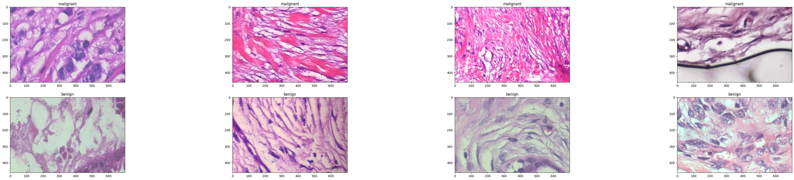

  

# Breast cancer images on histopathology slides

This dataset1 contains images of breast cancer on histopathology slides.

The data can be used to build and train an ML model that can detect breast cancer..

# Structure

This repo contains the following structure:

- **data/**: contains the csv files and folder with images
  - **dastaset.csv**: CSV file for Perceptilab use case.
  - **train/test**: folders with images stored in malign/benign folders

  

The following shows a partial example of the data stored in the dataset.csv that is used as main example.

| **images** | **labels** |
|------------|--------------|
| data/train/benign/SOB_B_F-14-29960AB-400-015.png |	benign |
| data/train/benign/SOB_B_PT-14-21998AB-400-039.png |	benign |
| data/train/benign/SOB_B_A-14-29960CD-400-004.png |	benign | 

# Community

Got questions, feedback, or want to join a community of machine learning practitioners working with exciting tools and projects? Check out our [Community](https://forum.perceptilabs.com/)!

1 Dataset Credits: https://www.kaggle.com/forderation/breakhis-400x
